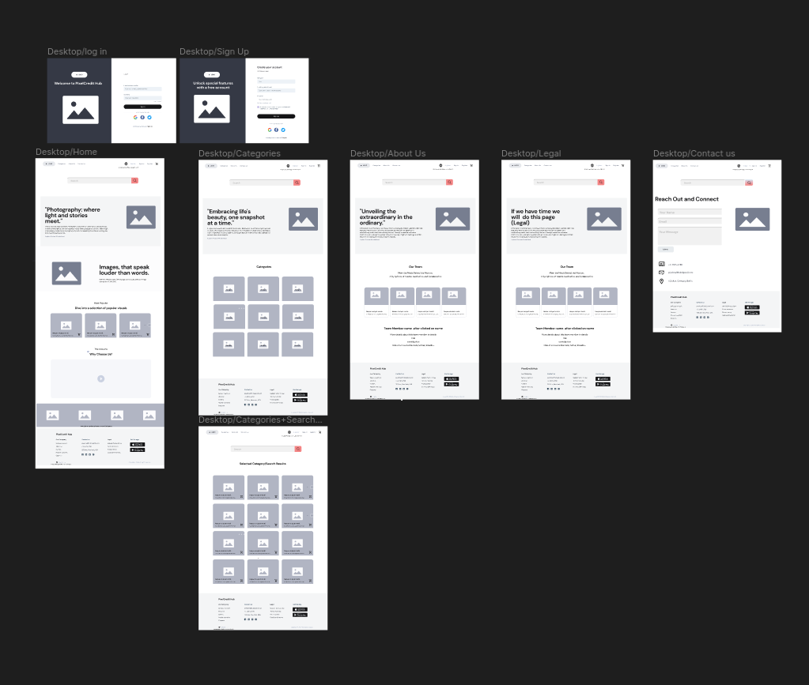

# PixelCreditHub

PixelCreditHub is a photosharing platform where users can upload their photos to sell and also purchase photos from other photographers. This README file provides an overview of the project, its features, technologies used, and instructions for setup.


## Overview of Site


 
## Team Members

- [Masouma](https://github.com/Masouma-Rasouli)

- [Daniel](https://github.com/SureLife)
  
- [Neha](https://github.com/NehaMehta2005)

 Team MDN
  
### Features
- User authentication and authorization
- Photo uploading and selling functionality
- Photo purchasing capability
- Intuitive user interface for easy navigation
- Responsive design for compatibility across devices 

### Wireframe

We used Figma for designing the wireframe of our application. 



### Built With

#### Client-side

* [React.js](https://reactjs.org/)
* [Bootstrap](https://getbootstrap.com/)
* [@mui/material](https://mui.com/)
* [axios](https://axios-http.com/)

#### Backend
* [Express.js](https://expressjs.com/)
* [bcrypt](https://www.npmjs.com/package/bcrypt)
* [jsonwebtoken](https://www.npmjs.com/package/jsonwebtoken)
* [MongoDB Atlas](https://www.mongodb.com/cloud/atlas)
* [uuid](https://www.npmjs.com/package/uuid)

## Installation and Setup  
1. Clone the repository:

    ```
    git clone https://github.com/SureLife/PixelCredit-Hub
    ```

2. Install dependencies for both client and server:

   ```bash
    cd PixelCreditHub/CLIENTSIDE
    npm install
    cd ../BACKEND
    npm install
    ```

3. Configure environment variables:
 - Create a `.env` file in the `server` directory.
 - Add the following variables and replace placeholder values with actual values:
    ```
    PORT = 5500
    SECRET_KEY=secureSecretKey 
    EMAIL_USERNAME=your-email@gmail.com
    EMAIL_PASSWORD=your-email-password
    ```

4. Start the server and client:

## License
This project is licensed under the MDN License.
